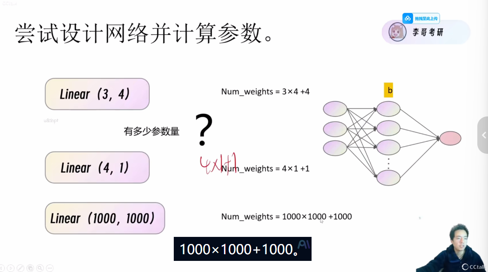
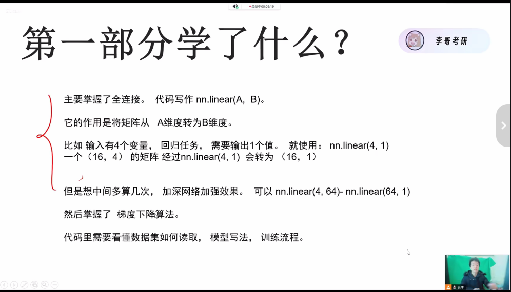

# COVID-19 回归实战学习笔记

---

## 核心思路

一个深度学习项目的核心目标是得到一个**好的模型**。

为了得到模型，我们让数据经过模型，得到预测数据，然后与真实数据进行对比，不断调整自己的模型。

---

## 训练流程（一个 Epoch）

```python
for batch_x, batch_y in dataset:
    # 前向传播
    预测数据 = 模型(batch_x)
    
    # 计算损失
    损失 = 损失函数(预测数据, 真实_y)
    
    # 反向传播
    损失.backward()
    
    # 更新参数
    优化器.step()
    优化器.zero_grad()
```

---

## 模型组件

### Linear 全连接层

全连接层可以改变模型，是神经网络中最基础的组件。

---

## 重要技巧

### 1. 计算模型参数量

一定要学会计算神经网络的参数量！学会计算模型的参数量就**知道了模型的架构**。



---

## 项目经验总结

### 数据处理的重要性

**项目和项目之间的差距就在数据处理上**，至于模型和训练没有太大差别，数据处理最难！

| 部分 | 难度 | 备注 |
| :--- | :---: | :--- |
| 数据处理 | ⭐⭐⭐⭐⭐ | 最关键，决定项目上限 |
| 模型构建 | ⭐⭐ | 相对固定 |
| 训练流程 | ⭐⭐ | 有通用模板 |

---

## 关键感悟

1. 数据处理是核心难点和竞争力所在
2. 理解参数量计算能帮助你理解模型结构
3. 训练流程有固定模板，可以快速复用


回归任务学习的神器：nn.Linear


回归任务是找一条线

分类任务是找分割线

在该项目中用one-hot编码表示40个州，每个州用一个向量表示，向量的每个元素表示该州的某个特征。