# 深度学习分类任务 — 学习笔记

---

## 一、分类任务基础

### 1.1 One-Hot 编码

分类任务通过 **one-hot 编码**表示分类结果。one-hot 编码是一个向量，向量的每个元素表示该分类的概率。

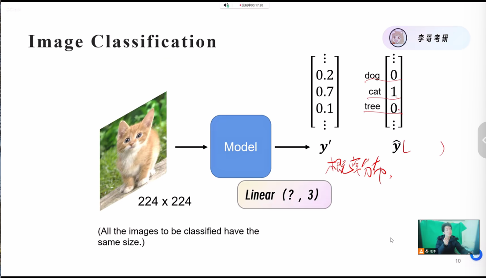

### 1.2 分类任务的目标

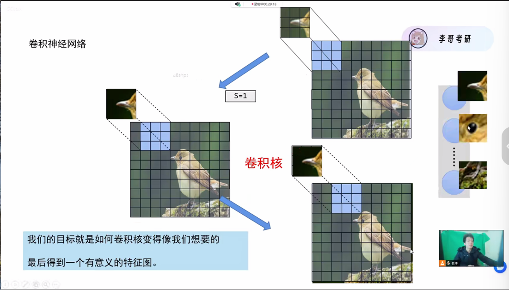

### 1.3 基本分类模型结构

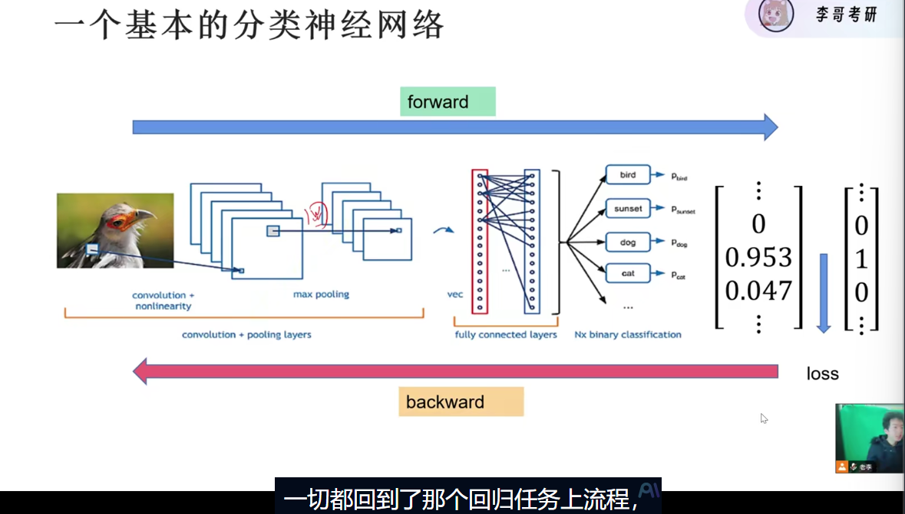

### 1.4 经典图片数据集

| 数据集             | 说明                                      |
| ------------------ | ----------------------------------------- |
| **MNIST**    | 手写数字识别，10 类，28×28 灰度图        |
| **Cifar10**  | 10 类彩色图片，32×32                     |
| **ImageNet** | 大规模图像数据集，1000+ 类，常用 224×224 |
| **COCO**     | 目标检测/分割数据集，80 类                |

---

## 二、损失函数

### 交叉熵损失（CrossEntropyLoss）

求分布之间的 loss 用交叉熵损失：

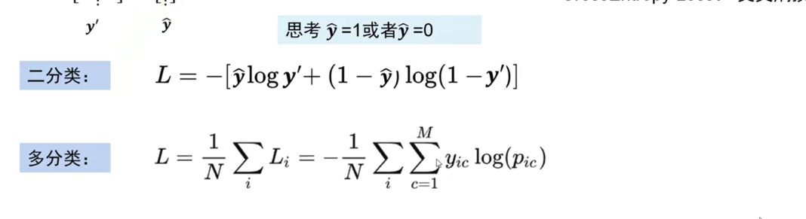
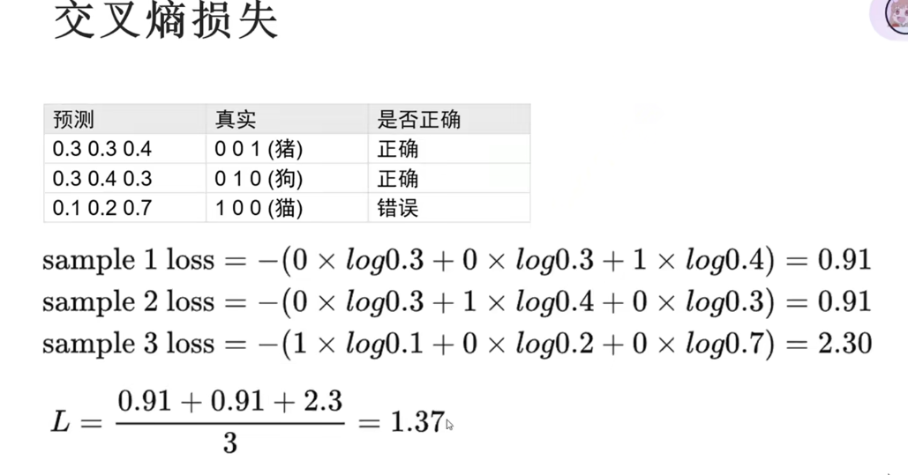
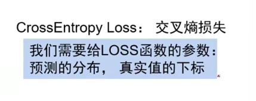

---

## 三、图片基础

### 3.1 图片尺寸

图片大小统一用 **224×224** 像素，这是常用的图片大小，可以提高模型性能。

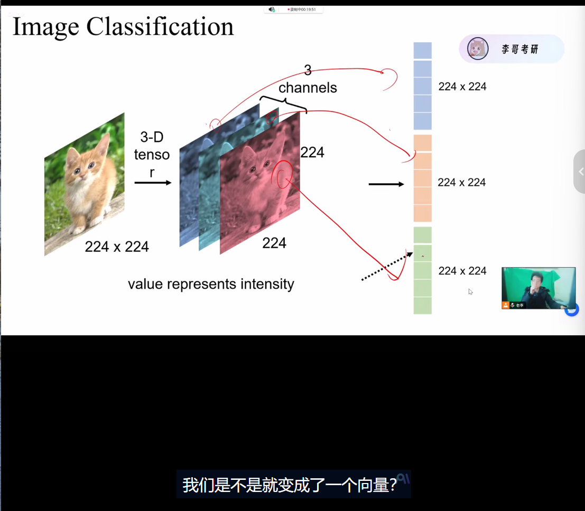

### 3.2 图片的基本构成

图片由 **C × H × W** 三个维度组成：

- **C**（Channel）：通道数（RGB 为 3）
- **H**（Height）：高度
- **W**（Width）：宽度

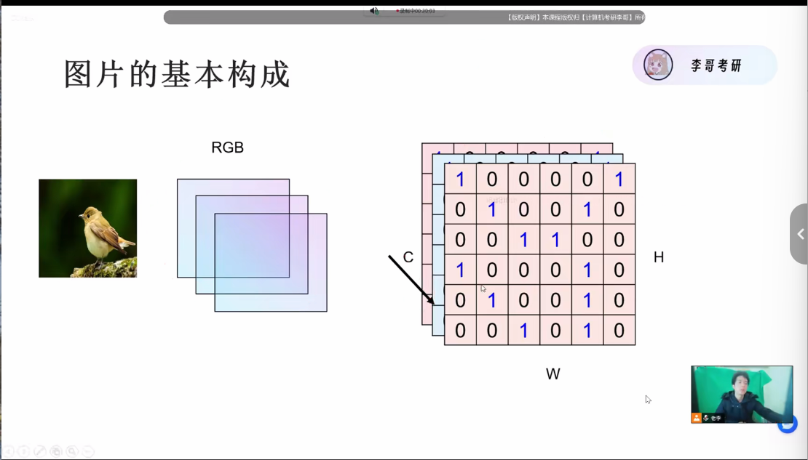

### 3.3 为什么不能直接用全连接层？

不能直接使用全连接 Linear，因为参数量太大：

> 224 × 224 × 3 × 1000 + 1000 = **16,288,001** 个参数

参数太大容易导致过拟合。

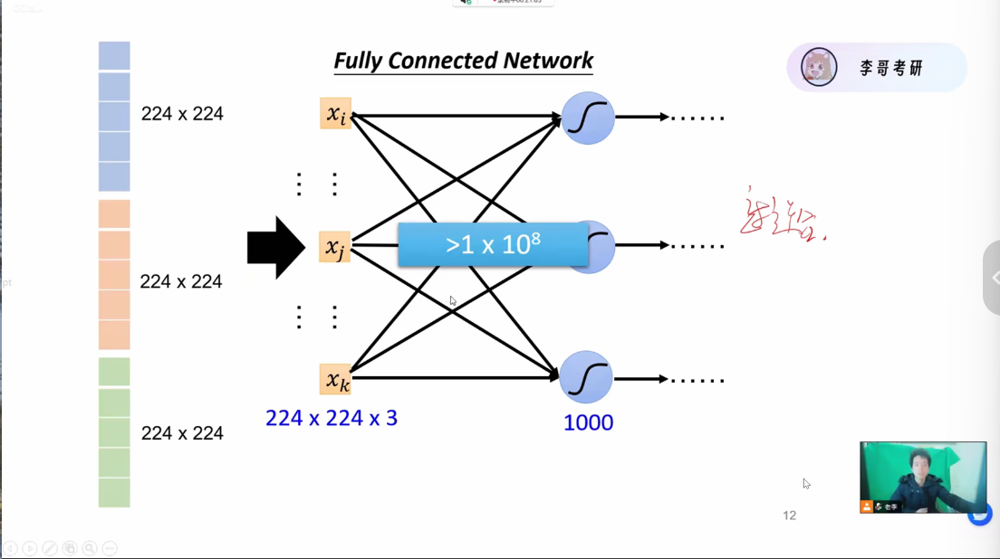

---

## 四、卷积（Convolution）

### 4.1 卷积的含义

> 「卷」是卷动的意思，「积」是求和的意思 —— 卷积 = 对应位置相乘再相加

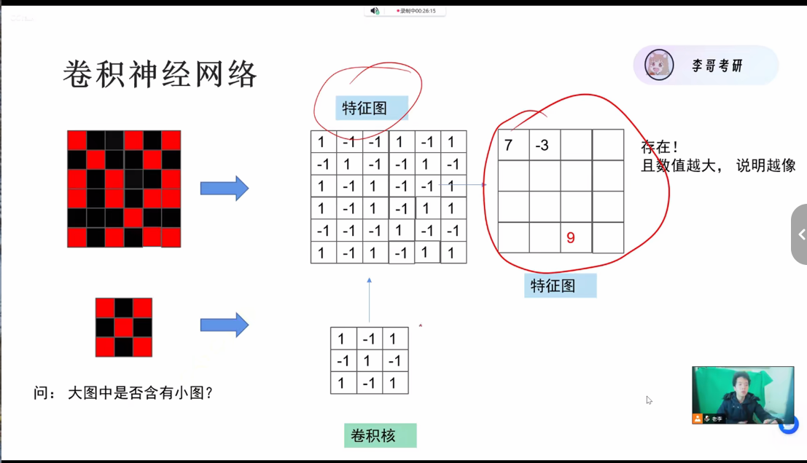

### 4.2 感受野

**卷积核的大小**称为神经元的感受野（Receptive Field）。

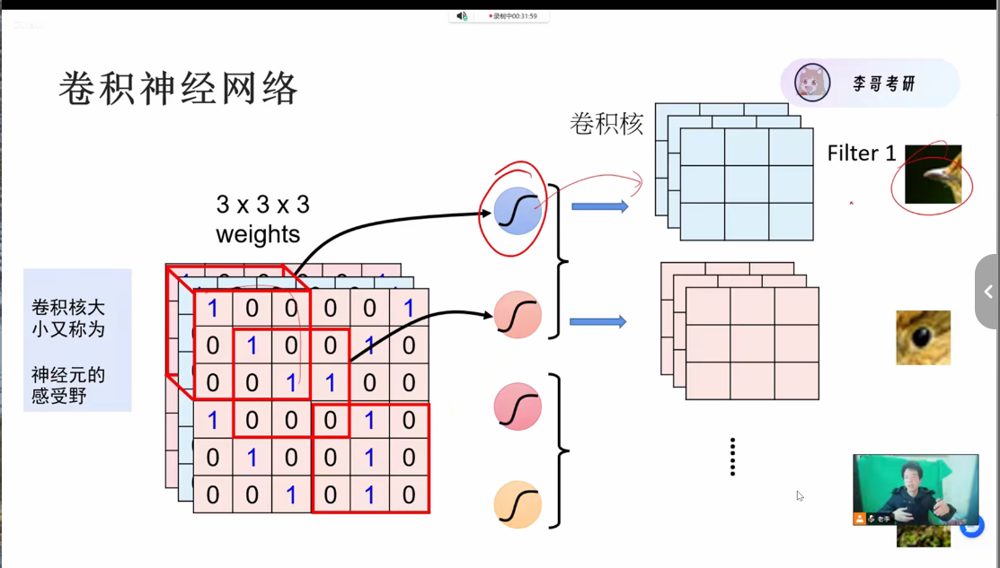

### 4.3 特征图

不同的卷积核会得到不同的特征图：

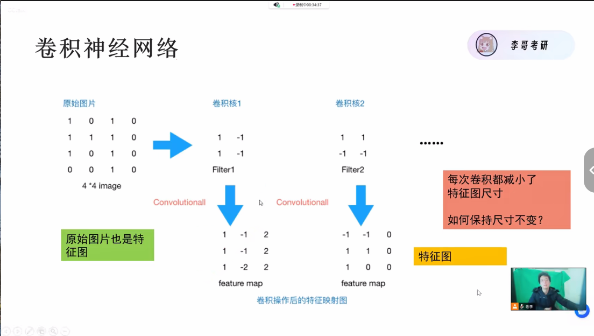

### 4.4 Q&A

**Q：原始特征图、新特征图和卷积核的深度有什么关系？**

> A：**卷积核的深度 = 原始特征图的通道数**；**卷积核的个数 = 新特征图的通道数**。
>
> 例如：输入为 3×224×224（C=3），使用 64 个 3×3 卷积核，则每个卷积核的深度为 3，输出特征图为 64×H×W。

**Q：一个卷积层是什么？**

> A：一个卷积层 = **卷积操作 + 激活函数**（有时还包括池化/归一化）。它包含若干个可学习的卷积核，每个卷积核在输入上滑动并计算，提取不同特征。

**Q：卷积核的参数量如何计算？**

> A：**参数量 = 卷积核宽 × 卷积核高 × 输入通道数 × 输出通道数 + 输出通道数（bias）**
>
> 例如：输入 3 通道，64 个 3×3 卷积核 → 参数量 = 3×3×3×64 + 64 = **1,792**

---

## 五、Padding 与降采样

### 5.1 Padding（填充）

通过 **zero-padding** 让特征图尺寸保持不变：


### 5.2 降采样（特征图变小）

两种方式让特征图变小：

1. **扩大 stride（步长）**：很少用，因为会丢失信息
2. **Pooling（池化）**：更常用

### 5.3 卷积尺寸计算公式

$$
O = \frac{I - K + 2P}{S} + 1
$$

| 符号 | 含义         |
| ---- | ------------ |
| O    | 输出尺寸     |
| I    | 输入尺寸     |
| K    | 卷积核尺寸   |
| P    | Padding 尺寸 |
| S    | Stride 步长  |

### 5.4 池化（Pooling）

#### 最大池化 vs 平均池化

| 类型               | 操作               | 特点                 |
| ------------------ | ------------------ | -------------------- |
| **最大池化** | 取池化区域内最大值 | 保留显著特征，更常用 |
| **平均池化** | 取池化区域内平均值 | 会丢失显著信息       |

> 人眼只关注最显著的特征，其他特征不那么显著。最大池化可以保留这些显著特征。

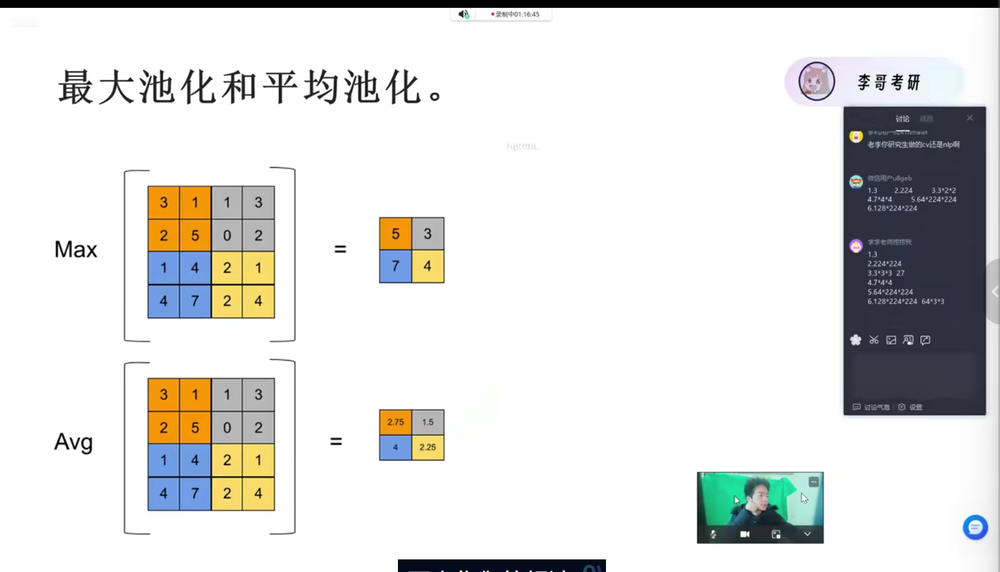

#### 适应性池化

- **适应性平均池化**（AdaptiveAvgPool）：无论输入多大，输出固定尺寸
- **适应性最大池化**（AdaptiveMaxPool）：同上，取最大值

#### 理解 Pooling 参数

`pooling(3, 2)` 中：

- `3` = 池化核大小（kernel_size）
- `2` = 池化步长（stride）

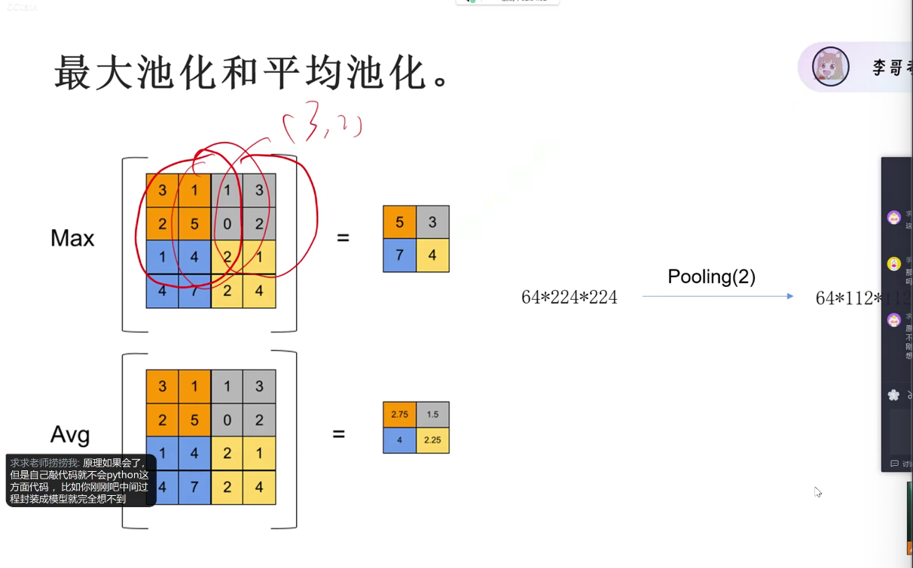

> 在实战中，卷积和池化经常交替出现。

---

## 六、Softmax

将输出转换为概率分布：

```python
y = torch.tensor([11.7, 23, 20], dtype=float)
softmax = nn.Softmax(dim=-1)  # dim=-1 表示对最后一维（分类数）做 softmax，不可省略
print(softmax(y))
```

---

## 七、关键技术

### 7.1 激活函数 — ReLU

- **ReLU**：可以在一定程度上**缓解梯度消失问题**
- **Sigmoid**：容易梯度消失

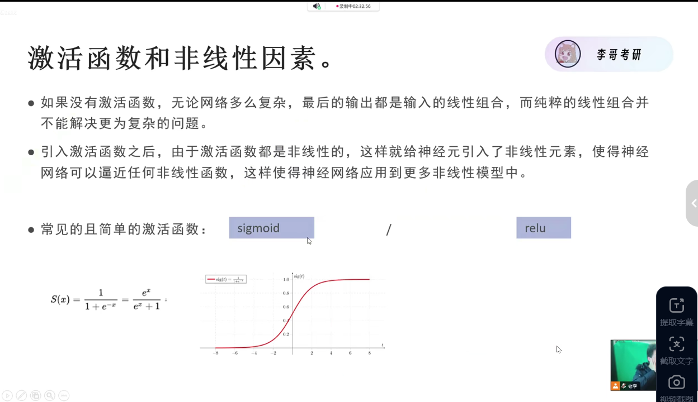

> 从梯度角度解释：Sigmoid 在两端饱和区梯度趋近于 0，多层叠加后梯度消失严重；ReLU 在正区间梯度恒为 1，不会饱和。

### 7.2 Dropout

**缓解过拟合问题**。训练时随机丢弃一部分神经元，测试时全部使用。

### 7.3 归一化（Normalization）

防止数据受到量纲影响，让模型更关注数据分布，可以：

- 保证有效性
- 缓解梯度消失和梯度爆炸

### 7.4 激活函数使用原则

激活函数可以随机加在任何位置，但需要确保网络之间维度是对的。

---

## 八、经典 CNN 模型

### 8.1 SOTA 概念

> **SOTA** = State-of-the-Art，指当前最优模型。

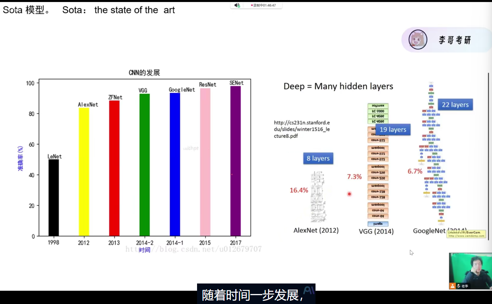

### 8.2 AlexNet

**创新点：**

1. 采用 **ReLU** 激活函数
2. 采用 **Dropout**
3. 采用**归一化**
4. 采用**池化**

### 8.3 VGG

特点：使用小卷积核（3×3）堆叠，增加网络深度。

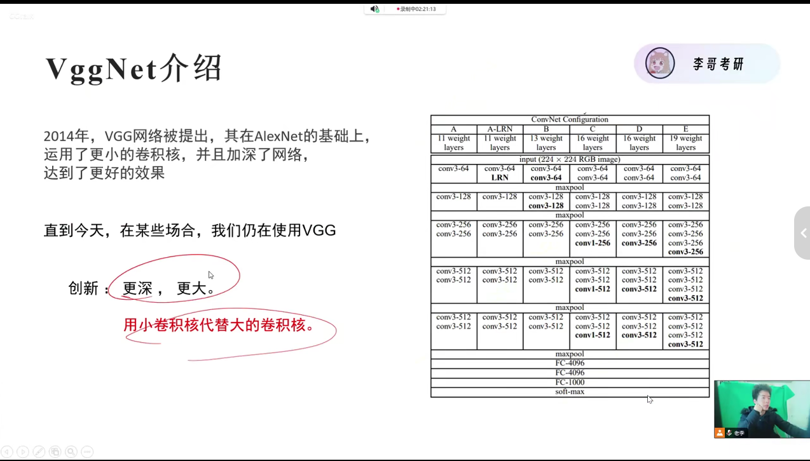
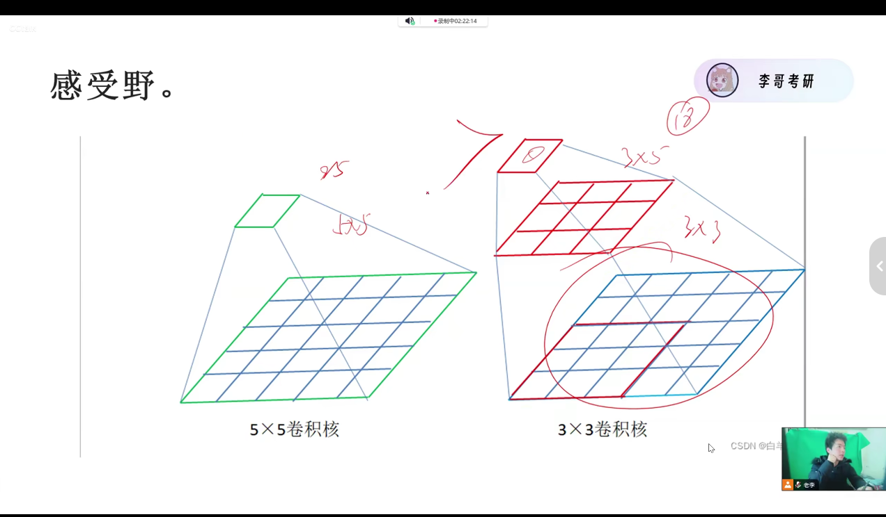
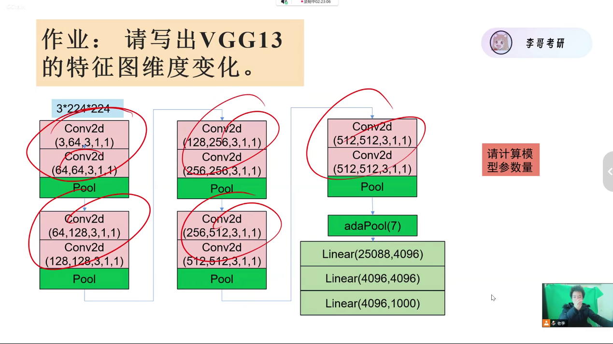
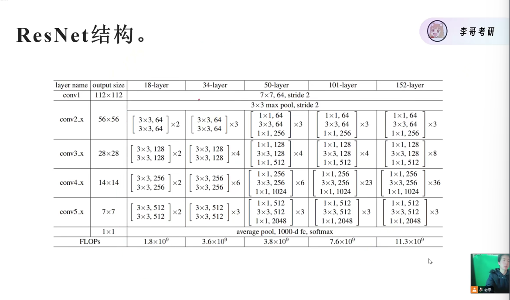

### 8.4 ResNet（残差网络）

> **out = f(x) + x**

- **x**：输入（恒等映射）
- **f(x)**：网络层学习的残差

模型越深效果反而越差（退化问题），ResNet 通过残差连接解决此问题。

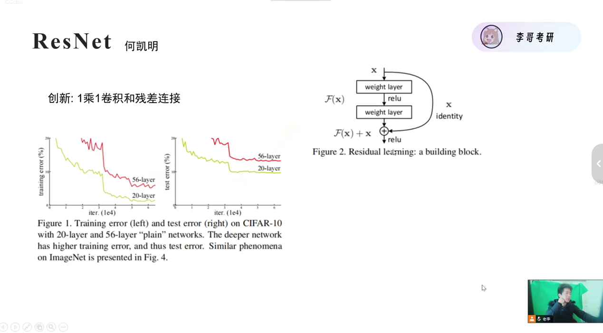
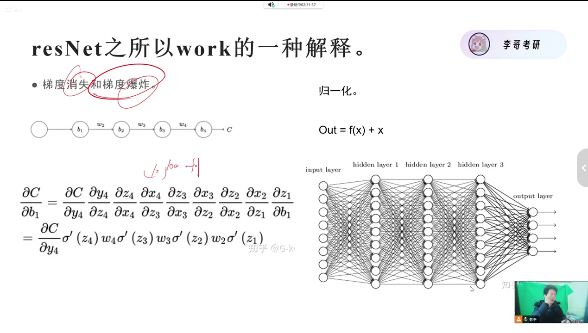

#### 残差计算的两种情况

**情况一：输入和输出通道数相同**

直接相加：`out = f(x) + x`

**情况二：输入和输出通道数不同**

通过 **1×1 卷积**改变通道数，再进行残差计算。

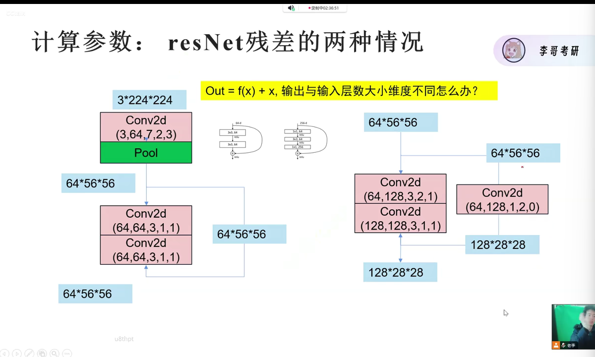

---

## 九、Conv2d 函数参数

```python
Conv2d(in_channels=,   # 输入通道数
       out_channels=,  # 输出通道数（卷积核个数）
       kernel_size=,   # 卷积核尺寸
       stride=,        # 步长
       padding=,       # 填充
       dilation=,      # 空洞卷积
       groups=,        # 分组卷积
       bias=)          # 是否使用偏置
```

---

## 十、卷积与全连接的关系

> 卷积 = 稀疏连接 + 权重共享的全连接

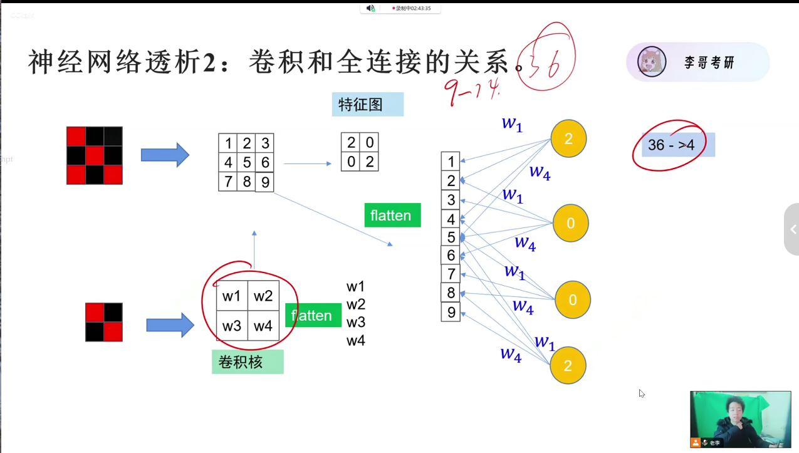

---

## 十一、核心思想

> **深度学习 = 玩特征**

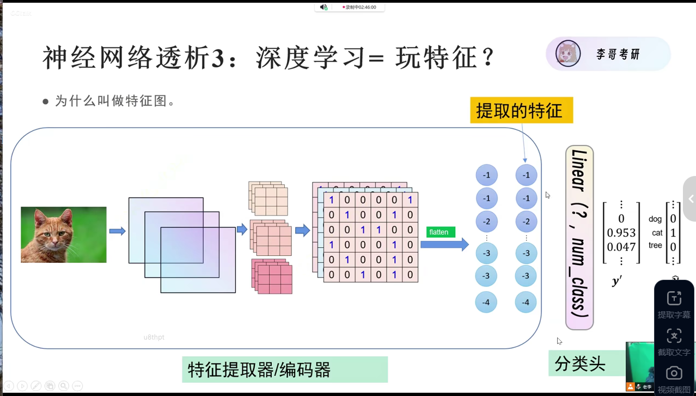
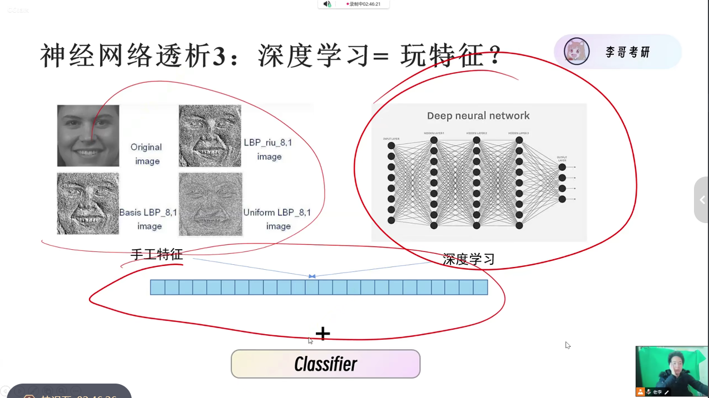

### 实用建议

- **计算参数量**是掌握模型的捷径
- 显卡推动了神经网络的发展
- 做项目一定要了解该领域的背景和历史发展

---

## 十二、练习题目

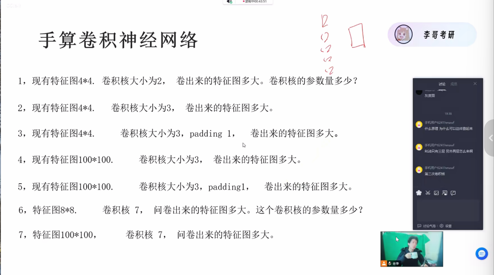

---

## 十三、数据增广（Data Augmentation）

### 13.1 概念与作用

数据增广是在训练过程中对数据进行随机变换，**增加数据多样性**，防止过拟合。

### 13.2 常用增广方法

在取数据的时候进行增广：
- **随机裁剪**（RandomResizedCrop）
- **随机旋转**（RandomRotation）
- **放大/缩小**
- **翻转**

---

## 十四、优化器对比

| 优化器 | 特点 | 适用场景 |
|--------|------|----------|
| **SGD** | 只看当前梯度，简单但不稳定 | 基础优化器，需要精心调参 |
| **Adam** | 同时考虑当前梯度和历史梯度，自适应学习率 | 最常用，效果稳定 |
| **AdamW** | Adam + 权重衰减（Weight Decay） | 正则化效果更好，推荐使用 |

> **SGD经常训练失败**，Adam和AdamW更稳定。

---

## 十五、关键代码理解

### 15.1 计算准确率

```python
train_acc += np.sum(np.argmax(pred.detach().cpu().numpy(), axis=1) == target.cpu().numpy())
```

**分解说明：**
- `pred.detach()`：从计算图中分离，避免梯度追踪
- `.cpu()`：将张量从GPU移到CPU
- `.numpy()`：转换为NumPy数组
- `np.argmax(..., axis=1)`：在最后一维（分类维度）取最大值索引
- 比较预测结果与真实标签，求和得到正确预测数

### 15.2 argmax 函数

```python
np.argmax(array, axis=1)  # 返回每行最大值的索引
```

- `axis=1`：表示在最后一维（分类数）上取最大值的索引
- 返回值是预测的类别索引

---

## 十六、迁移学习（Transfer Learning）

### 16.1 概念

迁移学习是**数据量少时的最佳选择**，利用预训练模型的知识解决新任务。

### 16.2 核心思想

> **特征提取器不变，只改分类头**


### 16.3 两种策略

| 策略 | 描述 | 适用场景 |
|------|------|----------|
| **线性探测（Linear Probing）** | 冻结预训练模型参数，只训练新的分类头 | 数据量极少，完全相信预训练模型 |
| **微调（Fine-tuning）** | 解冻部分或全部参数，一起训练 | 数据量较多，需要适配新任务 |

### 16.4 预训练的意义

- **预训练与真实训练数据无关**：在大规模通用数据集上训练
- **对于大模型时代来说，数据就是石油**
- 有预训练模型时尽量使用预训练模型

---

## 十七、半监督学习（Semi-supervised Learning）

### 17.1 概念

既有有标签数据也有无标签数据，通过模型对无标签数据自动打标签。

### 17.2 学习流程

```
step1: 读取有标签数据和无标签数据
step2: 用现有模型对无标签数据进行分类
step3: 如果预测置信度超过阈值，则将其作为伪标签
step4: 将有标签数据和带伪标签的数据合并，重新训练模型
```

### 17.3 三种学习方式对比

| 学习方式 | 数据特点 |
|----------|----------|
| **监督学习** | 有X有Y（全部有标签） |
| **无监督学习** | 只有X没有Y（全部无标签） |
| **半监督学习** | 部分有标签，部分无标签 |

---

## 十八、归一化的好处

- **加速收敛**：使数据分布更稳定
- **缓解梯度消失/爆炸**
- **增强模型泛化能力**

---

## 作业

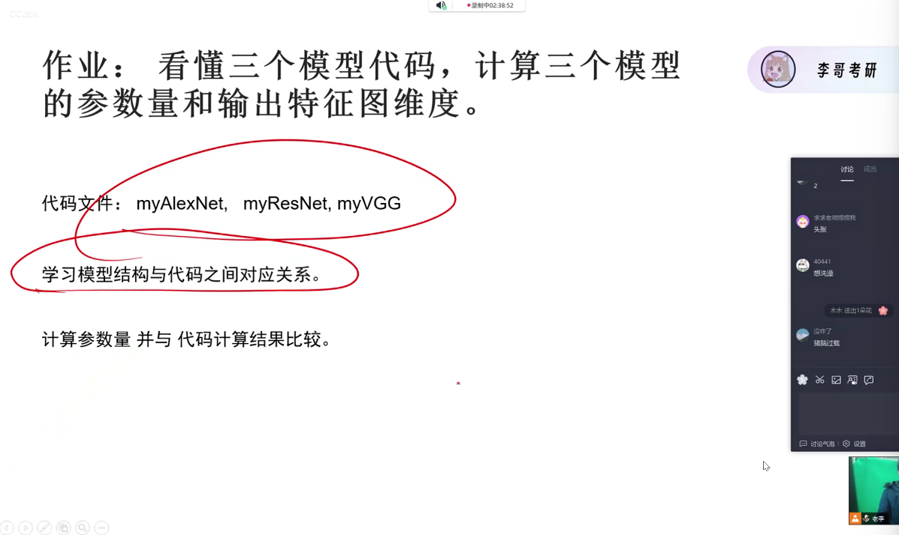

---

## 项目建议

写简历时不要用"食物分类"这个项目，可以改为别的方向。**亮点**可以突出：
- 数据增广策略
- 半监督学习方法

---

*更新时间：2026.5.4*